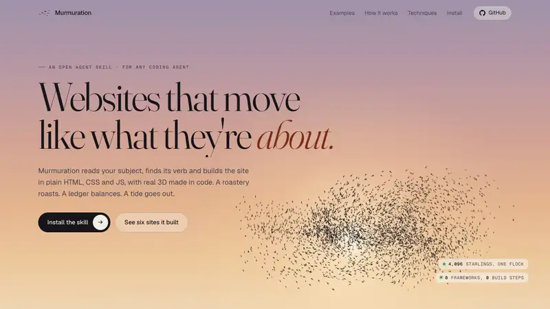
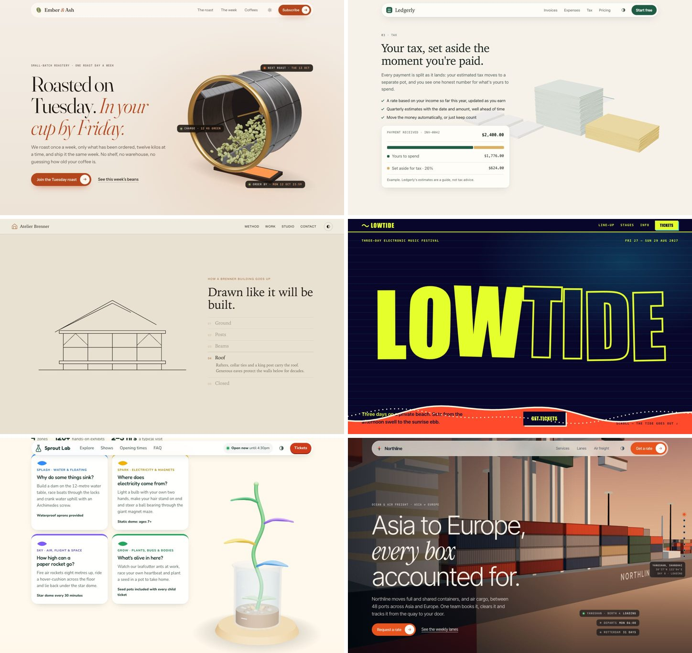

<div align="center">

# Murmuration

**Websites that move like what they're about.**

An open agent skill. It reads your subject, finds its verb and builds the site in plain HTML, CSS and JS, with real 3D made in code. No framework, no build step. It runs in Claude Code, Codex, Cursor, GitHub Copilot, Gemini CLI and any agent that reads `SKILL.md`.

[Website](https://aniketshukla1.github.io/murmuration/) · [Install](#install) · [Six examples](#six-briefs-six-worlds) · [How it works](#how-it-works) · [Techniques](#nineteen-signature-techniques)

<a href="https://aniketshukla1.github.io/murmuration/"></a>

</div>

## Why

Ask an AI for an "animated landing page" and you get the same page every time: a gradient blob, drifting particles, a globe of dots, cards that tilt. Murmuration starts from the subject instead. A roaster watches a curve. A ledger balances. A frame goes up. A tide goes out. The motion comes from those verbs, so a coffee roastery and an accounting app never come out moving the same way.

## Six briefs, six worlds

Each of these was built by the skill in a fresh, isolated session (only the skill loaded) from the one-line prompt shown, told to decide everything itself. None chose the same motion, and none reached for particles. The same `SKILL.md` runs in any agent. Each site was then opened in a real browser and fixed where it broke, which is the skill's own last step; [`examples/README.md`](examples/README.md) lists every fix.

<a href="https://aniketshukla1.github.io/murmuration/#examples"></a>

| Site | The prompt (excerpt) | What it built | Its verb |
|---|---|---|---|
| [Ember & Ash](https://aniketshukla1.github.io/murmuration/examples/coffee-roastery/), a coffee roastery | "a small-batch coffee roastery that roasts every Tuesday … premium and animated, with light and dark mode" ([full](evals/coffee-roastery/prompt.md)) | a roasting drum, made in code, that turns as you scroll while the beans inside go from green to brown | *roast* |
| [Ledgerly](https://aniketshukla1.github.io/murmuration/examples/accounting-app/), an accounting app | "an accounting app that helps freelancers send invoices, track expenses and set money aside for tax … animated, but it has to feel trustworthy" ([full](evals/accounting-app/prompt.md)) | a 3D desk of paper: the receipts sort into piles and the tax share of the payment lifts into its own pot | *set aside, sort, balance* |
| [Atelier Brenner](https://aniketshukla1.github.io/murmuration/examples/architecture-studio/), an architecture studio | "a five-person architecture studio that builds timber houses … with tasteful motion" ([full](evals/architecture-studio/prompt.md)) | a timber house that goes up as you scroll, piece by piece, as the sun moves to dusk | *raise* |
| [Lowtide](https://aniketshukla1.github.io/murmuration/examples/music-festival/), a music festival | "a three-day electronic music festival on a beach in late August … bold, loud and animated" ([full](evals/music-festival/prompt.md)) | a beach where the sun sets, the tide goes out and a sandbar rises carrying the stage | *the tide goes out* |
| [Sprout Lab](https://aniketshukla1.github.io/murmuration/examples/kids-science-museum/), a children's science museum | "a hands-on science museum for children aged 5 to 12 … playful and animated, and parents need to find opening times and tickets easily" ([full](evals/kids-science-museum/prompt.md)) | a seedling in a lab beaker that sprouts a leaf for each zone of the museum as you read | *sprout* |
| [Northline](https://aniketshukla1.github.io/murmuration/examples/freight-forwarder/), a freight forwarder | "an ocean and air freight forwarder that moves containers between ports across Asia and Europe … cinematic, like an Awwwards site of the day" ([full](evals/freight-forwarder/prompt.md)) | one container ship on a simulated ocean, sailing Shanghai to Rotterdam as you scroll | *load, sail, arrive* |

## How it works

1. **Reads your project** if there is one: the product, the brand's colours and fonts, the assets that exist (photos, video, renders, a 3D model), the stack.
2. **Interviews you** in two short rounds: what the first five seconds should feel like, how you see the hero, how much should move, references you love, then what is real. Every option is about your subject, and "you decide" is always one of them. Say "just build it" and it skips the questions and tells you what it assumed.
3. **Offers two or three directions** that genuinely differ, and you pick.
4. **Writes `MOTION.md`**: the signature, the verb it comes from, an intensity from 1 to 10, the timing tokens, and what the page looks like with the motion removed.
5. **Builds it**: real content first, then the signature, in 3D built from code unless you ask for flat. A drawn stand-in wherever WebGL is missing, finished stills under reduced motion.
6. **Checks it with its own eyes**: screenshots in both themes, a short laptop window, a phone, without WebGL, under reduced motion, at the in-between scroll positions where people stop to read, and once in a real GPU browser.

## Install

Murmuration is an open [Agent Skill](https://agentskills.io): one folder with a `SKILL.md`, read the same way by every agent that supports the standard.

**Any agent** (Claude Code, Codex, Cursor, GitHub Copilot, Gemini CLI, OpenCode, Windsurf, Goose, Amp, Kiro, Roo Code, Cline, Junie, Antigravity, OpenClaw and more):

```
npx skills add aniketshukla1/murmuration
```

It asks which agents to install into. Add `-a codex` (or `cursor`, `gemini-cli`, `github-copilot`, …) to pick one, and `-g` to install it for every project.

**Claude Code plugin:**

```
/plugin marketplace add aniketshukla1/murmuration
/plugin install murmuration@murmuration
```

**By hand:** copy `skills/murmuration` into your agent's skills folder: `.agents/skills/` for Codex, Cursor, Copilot, Gemini CLI, OpenCode, Amp and Cline, or `.claude/skills/` for Claude Code. Chat apps that take skill uploads, such as claude.ai (Settings → Capabilities → Skills), take `murmuration-skill.zip` from the [latest release](https://github.com/aniketshukla1/murmuration/releases/latest).

Then ask your agent for a site: *"Make a website for my pottery studio, Kiln & Clay. Make it 3D and mind-blowing."*

## Nineteen signature techniques

The skill picks one signature per page from the subject and the assets you have, and two to four quiet supporting moves. Particles are one option among nineteen, not the default.

| Family | Techniques |
|---|---|
| Scenes and objects | a 3D object (turning, relit, built from primitives when there is no model) · a 3D world or flythrough · a particle cloud that re-forms per section · a globe or map with routes · an image sequence scrubbed by scroll · video |
| Surfaces and fields | a shader field (mesh, aurora, liquid metal, dither, halftone, ASCII) · a generative canvas · physics |
| Drawing and type | line drawing and SVG mask reveals · type as the image · illustration in motion |
| Space and structure | depth layers · pinned chapters · image transitions |
| Interaction and pacing | cursor-led reveals · page choreography · a mechanic (hold to advance, a small game) · data in motion |

Each has a recipe with what it fits, how to build it without a framework, what it costs, and what the page shows at rest: [`references/catalogue.md`](skills/murmuration/references/catalogue.md).

## The website, built with the skill

[The website](https://aniketshukla1.github.io/murmuration/) follows the skill's own method. Its brief is in [`site/MOTION.md`](site/MOTION.md): four thousand starlings simulated on the GPU wheel against a sunset and gather into each example's subject as you scroll past it, and the pointer is a falcon the flock parts around. [Vesper](https://aniketshukla1.github.io/murmuration/vesper/), the first demo, is a made-up night-train company told with one particle cloud.

## What's inside

```
skills/murmuration/
  SKILL.md                 the workflow and the rules
  references/              interview, motion language, the catalogue, particles, effects, verification
  templates/               murmuration.js (particle engine), scene.js, sequence.js, shader-bg.js,
                           site.js, starter.html/.css, layered-mark.tsx (React Native)
  scripts/                 shoot.mjs (headless screenshots, finds Chrome on macOS, Linux and Windows), sheet.py
site/                      the website: index.html, flock.js (the GPU flock), MOTION.md
examples/                  the six sites above, as the skill built them, plus the fixes
demo/                      Vesper
evals/                     test cases for `claude plugin eval` (Claude Code's eval runner): six genres and an interview check
tools/                     record.mjs and make-media.py (videos and stills), check.py (CI)
```

## Test it yourself

```
claude plugin eval . --ablation none --runs 1 --allow-tools Write Edit
```

Each case runs in a fresh Claude Code session with only this plugin loaded. `--allow-tools Write Edit` lets the runs write their site; without it they can't create files and the graders fail. In any other agent, install the skill, open a fresh session in an empty folder and paste a prompt from [`evals/`](evals/). Add a case for your own genre and see what it chooses.

## Contributing

Issues and pull requests are welcome. Before a pull request, run `python3 tools/check.py` and, if you touched the engine, the demo or the website, `node skills/murmuration/scripts/shoot.mjs` on it at the sizes in `references/verify.md`. New techniques go in `references/catalogue.md` with the same fields as the others.

## Licence

MIT, see [LICENSE](LICENSE). Fonts are under the SIL Open Font Licence: Instrument Serif in the demo ([`demo/fonts/OFL.txt`](demo/fonts/OFL.txt)), Fraunces and Geist on the website ([`site/fonts/OFL.txt`](site/fonts/OFL.txt)). Three.js is vendored under its MIT licence ([`site/vendor/LICENSE-three.txt`](site/vendor/LICENSE-three.txt)). Vesper and every brand in the examples are made up.

Created by Aniket Shukla and improved by its contributors.
