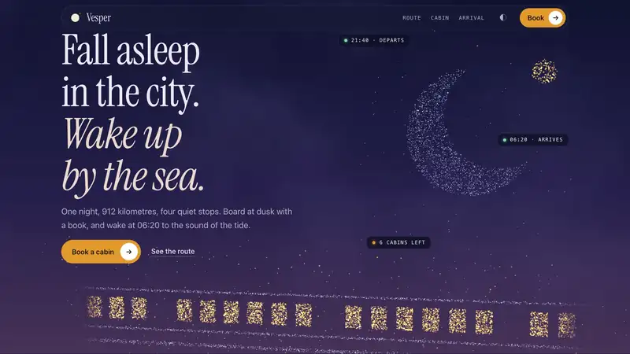

<div align="center">

# Murmuration

**Websites that move like what they're about.**

A skill for Claude that reads your project, asks what you picture, designs a motion language for your subject, and builds it in plain HTML, CSS and JS. No framework, no build step.

[Live demo](https://aniketshukla1.github.io/murmuration/) · [Install](#install) · [How it works](#how-it-works) · [Techniques](#19-signature-techniques) · [Same skill, different worlds](#same-skill-different-worlds)

<a href="https://aniketshukla1.github.io/murmuration/"></a>

</div>

## Why

Ask an AI for an "animated landing page" and you get the same page every time: a gradient, drifting particles, a marquee, cards that tilt. Murmuration starts from your subject instead. A night train glides. A roaster watches a curve. A ledger balances. An architect draws. The motion comes from those verbs, so a coffee roastery and an accounting app never come out moving the same way.

## How it works

1. **Reads your project** if there is one: what the product is, the brand's colours and fonts, the assets that exist (photos, video, renders, a 3D model), the stack.
2. **Interviews you** in two short rounds: what the first five seconds should feel like, how you see the hero, how much should move, references you love, then what is real (assets, story, visitors, must and must not). Every option is about your subject, and "you decide" is always one of them. Say "just build it" and it skips the questions and tells you what it assumed.
3. **Offers two or three directions** that genuinely differ, and you pick.
4. **Writes `MOTION.md`**: the signature technique, the verb it comes from, an intensity from 1 to 10, the timing tokens, and what the page looks like with the motion removed.
5. **Builds it**: real content first, motion on top, a drawn stand-in wherever WebGL is missing, finished stills under reduced motion.
6. **Checks it with its own eyes**: screenshots in both themes, a short laptop window, a phone, without WebGL, under reduced motion, at the in-between scroll positions where people stop to read, and once in a real GPU browser.

## Same skill, different worlds

Each of these was built by the skill in an isolated session (only the skill loaded, no human edits) from a one-line brief. They were told not to ask questions, so each chose its own direction.

| Brief | What it chose to move | Why, in its words |
|---|---|---|
| A small-batch coffee roastery | the roast curve draws itself as you scroll, and a bean darkens from green to near-black along it | "a roaster's verb is *watch the curve*" |
| An accounting app for freelancers | a payment splits into tax, expenses and yours as you scroll; nothing loops | "motion that floats, glows or swirls reads as careless with money" |
| A timber architecture studio | a house is drawn in elevation, stage by stage, in the order it is built | "an architecture studio's verb is *draw*" |

## Install

**Claude Code**

```
/plugin marketplace add aniketshukla1/murmuration
/plugin install murmuration@murmuration
```

Or copy `skills/murmuration` into `~/.claude/skills/`.

**Claude.ai:** download `murmuration-skill.zip` from the [latest release](https://github.com/aniketshukla1/murmuration/releases/latest) and upload it as a custom skill (Settings → Capabilities).

Then ask for a site: *"Make a website for my pottery studio, Kiln & Clay. Make it 3D and mind-blowing."*

## 19 signature techniques

The skill picks one signature per page from the subject and the assets you have, and two to four quiet supporting moves. Particles are one option among nineteen, not the default.

| Family | Techniques |
|---|---|
| Scenes and objects | a particle cloud that re-forms per section · a 3D object (turntable, relit hero, depth scroll) · a 3D world or flythrough · a globe or map with routes · an image sequence scrubbed by scroll · video |
| Surfaces and fields | a shader field (mesh, aurora, liquid metal, dither, halftone, ASCII) · a generative canvas · physics |
| Drawing and type | line drawing and SVG mask reveals · type as the image · illustration in motion |
| Space and structure | depth layers · pinned chapters · image transitions |
| Interaction and pacing | cursor-led reveals · page choreography · a mechanic (hold to advance, a small game) · data in motion |

Each has a recipe with what it fits, how to build it without a framework, what it costs, and what the page shows at rest: [`references/catalogue.md`](skills/murmuration/references/catalogue.md).

## The demo: Vesper

[Vesper](https://aniketshukla1.github.io/murmuration/) is a made-up night-train company, built with the particle technique to show how far one engine goes when every shape is designed for one page: nine shapes and six custom motions, from lit carriages gliding past to a railway clock whose second hand sweeps and waits at the top. Its brief is in [`demo/MOTION.md`](demo/MOTION.md) and its scene in [`demo/scene.js`](demo/scene.js).

## What's inside

```
skills/murmuration/
  SKILL.md                 the workflow and the rules
  references/              interview, motion language, the catalogue, particles, effects, verification
  templates/               murmuration.js (particle engine), scene.js (format sample), sequence.js,
                           shader-bg.js, site.js, starter.html/.css, layered-mark.tsx (React Native)
  scripts/                 shoot.mjs (headless screenshots, finds Chrome on macOS, Linux and Windows), sheet.py
demo/                      Vesper
evals/                     test cases for `claude plugin eval`: six genres and an interview check
tools/                     record.mjs and make-media.py (the demo video), check.py (CI)
```

## Test it yourself

```
claude plugin eval . --ablation none --runs 1
```

Each case runs in a fresh session with only this plugin loaded. Add a case for your own genre and see what it chooses.

## Contributing

Issues and pull requests are welcome. Before a pull request, run `python3 tools/check.py` and, if you touched the engine or the demo, `node skills/murmuration/scripts/shoot.mjs` on the demo at the sizes in `references/verify.md`. New techniques go in `references/catalogue.md` with the same fields as the others.

## Licence

MIT, see [LICENSE](LICENSE). The demo's typeface, Instrument Serif, is under the SIL Open Font Licence ([`demo/fonts/OFL.txt`](demo/fonts/OFL.txt)). Vesper and every other brand in the examples are made up.

Created by Aniket Shukla and improved by its contributors.
